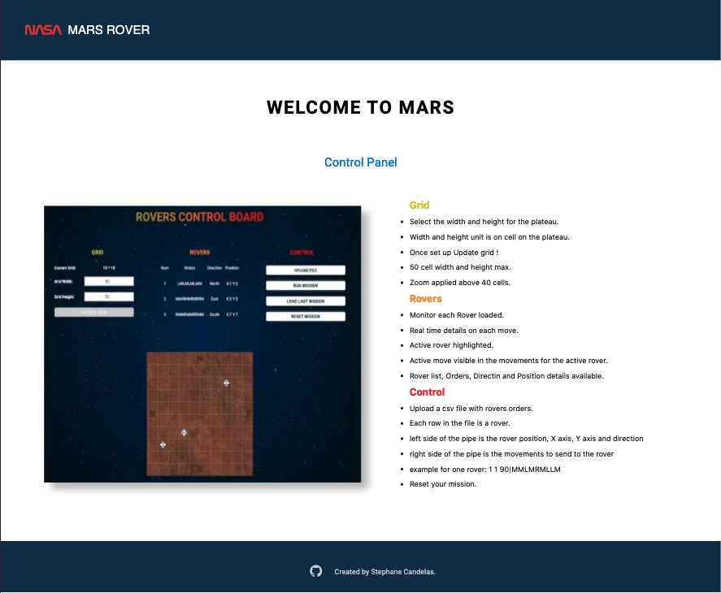
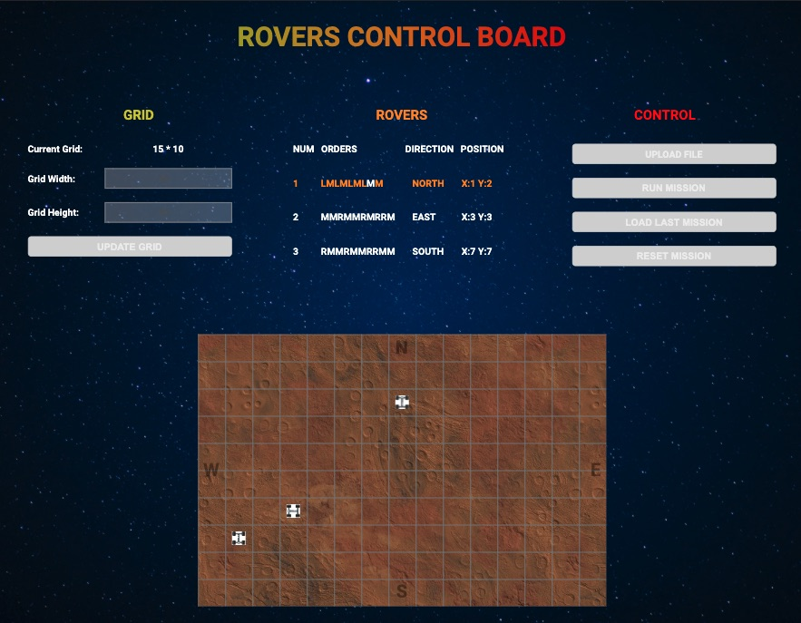

# Rover to mars

## Description

The goal for this project was to

1. Move a list of rovers inside a grid 10/10 or max 50/50 cells with the move forward (F) left (L) and right (R) command.
2. Each rover move one after another.
3. Accept a csv file with each row is the details needed for one Rover.
4. Left side of the pipe is the position as X axis, Y axis and the direction in degree.
5. Right side of the pipe is the orders for the movements.

## Overview

### Home page


### Rover on move


## Demo

[mars rover demo](https://share.getcloudapp.com/xQuboXq2)

## Tools

For this project I used create-next-app to speed up the development, React, and jsx style.
Jest and React-testing-library for the testing part.
My node version : v12.16.1
My npm version : 7.7.0

## Available Scripts

Before you can run any scripts below install the project with the command below :

```
git clone https://github.com/stephane777/mars_rover_2.git
```

Once you have cloned the repo you must run the command below to install all the dependencies.

```
npm install
```

In the project directory, you can run:

```
npm run test
```

Launches the test runner in the interactive watch mode.

```
npm run dev
```

Runs the app in the development mode.\
Open [http://localhost:3000](http://localhost:3000/) to view it in the browser.

The page will reload if you make edits.\
You will also see any lint errors in the console.

```
npm run build
```

This will build the application for production into the dist folder.
